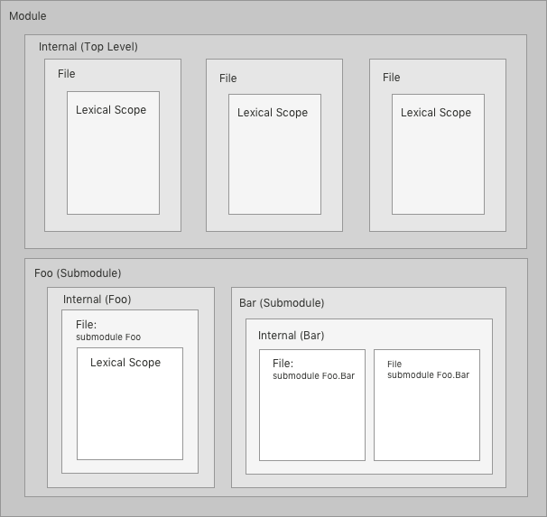

# Scope-based submodules

* Proposal: [SE-NNNN](NNNN-scope-based-submodules.md)
* Authors: [Matthew Johnson](https://github.com/anandabits)
* Review Manager: TBD
* Status: **Awaiting review**


## Introduction

This proposal describes a submodule system based on the principle of strictly nested scopes.  The design strives to follow the Swift philosophy of offering good defaults while progressively disclosing additional features on demand.  Starting to adopt submodules is as simple as adding a `.submodule` suffix to the name of a folder.


## Motivation

Swift currently provides two kinds of entities that provide system boundaries without directly introducing a symbol: modules and files*.

* Modules introduce an ABI boundary, a name boundary, and a scope boundary.
* Files introduce a scope boundary that carries no additional semantics.

Swift currently lacks the ability to introduce a name and scope boundary without also introducing an ABI boundary.  Such a boundary would be naturally situated halfway between in terms of strength and ceremony.  The lack of such a boundary significantly limits our abiltiy to structure a large Swift program.  Introducing a way to form this kind of boundary will provide a powerful tool for giving internal structure to a module.

*The important aspect of a file in Swift is the logical scope boundary it introduces.  The physical file system representation is incidental to this.  The appendix on file system independence discusses this in more detail.


## Goals

Any discussion of submodules inevitably reveals that there are very different perspectives of what a submodule is, what problems submodules should be able to solve, etc.  This section describes the design goals of this proposal in order to facilitate evaluation of both the goals themselves as well as how well the solution accomplishes those goals.

The primary goal of this proposal is to introduce units of encapsulation within a module that are larger than a file as a means of adding explicit structure to a large program.  All other goals are subordinate to this goal and should be considered in light of it.  

Some other goals of this proposal are:

* Submodules should help us to manage and understand the internal dependencies of a large, complex system.
* Submodules should be able to collaborate with peer submodules without necessarily being exposed to the rest of the module.
* A module should not be *required* to expose its internal submodule structure to users when symbols are exported.
* Using submodules should require as little ceremony and syntactic burden as possible.  Syntax should only be required where non-default semantics are necessary.
* It should be possible to extract a submodule from existing code with minimal friction.  The only difficulty should be breaking any circular dependencies.

Some additional non-functional requirements for the solution are:

* Submodules should not negatively impact runtime performance.  WMO should be able to see across submodule boundaries.
* Submodules should not negatively impact build performance.  Ideally they will improve build performance by giving the compiler more high-level information about internal dependencies.

Deferred goal:

* It is not an immediate goal to support submodules in single-file scripts.  The appendix discussing file system independence discusses some ideas that could be used to support single-file scripts in the future.


## Proposed solution

The proposed solution is to introduce a `.submodule` folder* suffix used to group files into hierarchical submodules as well as a `submodule` declaration which is used to specify availability and behavior of the submodule.

There are several relatively orthogonal aspects to the design of a submodule system.  A design must answer the following questions:

* How is code placed in a submodule?
* How do submodules interact with access control?
* How are symbols in one submodule made available to another submodule or module?

This proposal diverages a little bit from the usual proposal format to faciliate discussion of alternatives within the context of each aspect of the chosen design.  In each case an alternative could be substituted without compromising the overall design.

\*The term "folder" is intentionally vague.  It may refer to a file system durectory or a "folder" specified using a manifest file or build system configuration.  Using a manifest file or build system configuration is a reasonable approach *if* we assume good tool support for maintaining the submodule "folder" structure and for visualizing and navigating code organized according to the submodule structure.  If we cannot (or do not wish to) assume this tool support we should use the physical file system for defining submodules.  The author trusts the core team and the community review to reach the right decision on this topic.

*Note:* This proposal uses the term "top-level submodule" to distinguish the scope of code that is not explicitly placed in a submodule from the module as a whole.  The top-level submodule is in most respects identical to any other parent submodule.  The only difference is that the symbols declared within it are automatically imported when the module is imported.

### Placing code in a submodule

Each file is part of the top level submodule unless it is explicilty placed into a different submodule.

Folders* with a `.submodule` suffix introduce a new submodule.  Submodule folders may contain a `Submodule.swift` file that contains the full submodule declaration beginning with its first non-comment, non-whitespace line of code.  The submodule declaration must specify an internal submodule name that matches the name of the folder.  If the `Submodule.swift` file is omitted the submodule declaration for a folder named `Foo.submodule` is simply `submodule Foo`.

By convention a `Submodule.swift` file will usually contain *only* the submodule declaration but it is allowed to contain additional Swift code following the declaration.  Very small submodules may choose to simply place their code in the `Submodule.swift` file.

All source files contained in within a folder introducing a submodule are automatically placed in the submodule.  Files in descendent folders are also automatically placed in the submodule until a folder is reached that introduces a child submodule.

This example shows the folder structure of a module named `Foo`:

```
Foo
|- MyCode.swift
|- Bar.submodule
 |- Submodule.swift
 |- Baz.Swift
```

```swift
// Foo/Bar.submodule/Submodule.swift
// The Submodule.swift file and submodule declaration are used 
// when the submodule declaration needs to be annotated.
// When it does not they may be omitted and the `.submodule` folder suffix alone suffices.
submodule Bar
```

##### Submodule names form a hierarchical path.
* The fully qualified name of the submodule specified by `Submodule.InnerSubmodule` is: `MyModuleName.Submodule.InnerSubmodule`.
* In this example, `InnerSubmodule` is a child of `Submodule`.  The folder declaring `InnerSubmodule` must be a descendent of the folder declaring `Submodule`
* A submodule may not have the same name as any of its ancestors.  This follows the rule used by types.

A module is made up of strictly nested scopes that look like this:



#### Alternative: Use a declaration at the top of each file contained in the submodule

To create a submodule the user chooses an arbitrary file to include the primary submodule declaration.  Other files are placed into the submodule using a submodule extension declaration: `extends submodule Foo`.  

Distinguishing the primary submodule declaration and extensions is necessary for two reasons.  First, the primary declaration may contain an access modifier as well as annotations that control how the submodule appears to clients of the module.  Second, without this distinction it would be easy to accidentally introduce a new submodule by way of a typo: `submodule Fooo`.   Allowing an error like this is a sign of a flawed design.

#### Discussion

The preferred solution is chosen for several reasons:

* Submodules form a scope and scopes imply physical proximity.  The alternative allows a file in a distant part of the file system (or build configuration) to participate in the scope of a submodule.
* The alternative requires users to make an arbitrary choice of placement of the primary submodule declaration and makes it difficult for readers to find.
* The alternative requires declarations that are boilerplate-y when files are already organized by submodule.
* This approach makes it very easy for tools to identify the submodule structure of a program.
* It is easy to determine which folders introduce submodules without even looking at the contents of the folder.

The primary advantages of Alternative 2 are:

* It is immediately obvious what submodule a file resides in when reading the file.  Folder structure is not necessary.  Without good tool support the folder structure may not be immediately visible to users.
* The user has more freedom to organize files as they wish.  This is both an advantage and a disadvantage.  It allows the files of two submodules to reside in the same folder.  On the other hand it allows scope boundaries to be difficult to see by allowing the files of a submodule to be spread *anywhere* within a project.


#### Other Alternatives

##### Don't require a folder name extension, only use a submodule file

This approach requires a reader to look at the contents of a folder to before knowing whether it introduces a submodule or not.  It also requires a file that isn't necessary for a basic submodule declaration that does not use any annotations.

##### Use lexical scopes

Instead of organizing files into submodules we could use lexical scopes to organize declarations into submodules.  This is not mutually exclusive with the design of this proposal and could be introduced as a future enhancement to support scripting.  It is not used in this proposal because the primary use case of submodules is to organize files into larger scopes in large programs, it is not to support large single file programs such as scripts.

This approach has many disadvantages when it allows multiple files to place code in the same submodule.  These disadvantages are discussed in Appendix B.

##### Require all files to include a `submodule` declaration

We could require all files to include an explicit submodule declaration.  However, that would be a breaking change and would violate the principle of progressive disclosure.  Users should not need to know about submodules if they don't use them.

##### Allow submodule references to explicitly state the name of the module

The module name is implicit throughout the scope of the entire module.  Specifying it explicitly is redundant.  Prohibiting explicit mention of the module name offers more flexibility for combining submodules into build products.


### The submodule declaration

The basic form of the submodule declaration is `submodule Foo`.  It must always be placed on the first  non-comment, non-whitespace line of the file in which it appears.   It contains the name of the submodule without any ancestor prefix.


#### Access control

A submodule declaration may contain an access modifier.  The access modifier must specify a scope that is *greater* than submodule scope*.  A submodule that does not include an access modifier is available throughout the module by default.  Access to a submodule may be bounded by an ancestor submodule in the same way that the availability of a nested type may be bounded by the type it is nested in.

Examples of access modifiers:

* `public submodule Foo` is available for import outside the module but users outside the module may not inherit from any classes even if they are declared `open`
* `open submodule Foo` is available for import outside the module and users are allowed to inherit from `open` and override `open` methods.

*Allowing access modifiers less than or equal to submodule scope would not make any sense - the submodule would not be available to any other part of the program.

##### Submodule and module scopes

The author of this proposal has also introduced the companion proposal [A Consistent Foundation For Access Control: Scope-Bounded Capabilities](https://github.com/anandabits/swift-evolution/blob/scope-bounded-capabilities/proposals/NNNN-scope-bounded-capabilities.md).  This proposal provides enhancements to Swift's access control system that are designed to interact well with the design of scope-based submodules.  Specifically, it would be possible to reference ancestor submodules in access modifiers.  These references would allow the same shorthand available when referencing an ancestor type inside a nested type.

If this proposal is accepted `internal` would reference submodule scope.  In that case we may wish to consider introducing an alias for module-wide scope.

If this proposal is not adopted Swift's access control system will not include a way to reference both submodule scope and module scope.  In that case the author *recommends* making `internal` reference submodule scope and introducing a new access modifier for module scope.

A recommended name for module wide scope may be added to this proposal before review.  Suggestions are welcome.

##### Alternatives

###### Do not allow the `submodule` declaration to include an access modifier

In this approach the submodule is implicitly as available as the most available symbol it contains.

This approach makes the availability of a submodule itself difficult for a reader of the code to determine.  It also artificially prevents our ability to bound the availability of the submodule in the same way we can bound the availability of other declarations in Swift.  A seemingly arbitrary restriction like this should have a very strong justification which does not exist for submodules (as far as the author can tell).

###### Submodules are only allowed to see `public` and `open` symbols from other submodules

A module-wide scope is highly desirable.  People might avoid using submodules in some cases if this is not available.

This approach also creates a lot more friction when refactoring.  A possible workaround to the lack of a module-wide scope in this system is to place code in a non-exported submodule and declare symbols `public`.  Even with the workaround, extracting a submodule may not always be possible or desirable and the `public` access modifiers required would be misleading.  It would be much better to be able to state our intent directly.

###### Use `internal` to cover the whole module and `private` to cover a submodule

One suggestion that has appeared is the idea of removing `fileprivate` and making `private` be submodule-wide.  `internal` would remain module-wide.  This is too coarse - *many* people want a file-level scope.

`internal` is Swift's default access modifier.  A symbol with default access modifier should not be able to cross a submodule boundary implicitly.

###### Make module-wide symbol visibility the default

A significant purpose of submodules is to facilitate encapsulation and structure within a program.  Having a default of submodule scope does a better job of fulfilling this purpose.  It is also easier to migrate from a submodule default to a module-wide default that it is to make the opposite change if we later determine the wrong default was selected.

#### Export renaming

Submodules that contain an access modifier which makes the submodule available outside the module may also contain an annotation specifying how the symbols in the submodule appear when imported by code in other modules.  This is an example of a renamed submodule:

```swift
// in submodule Parent in module M
public submodule Foo1 exported as Bar

// elsewhere in submodule Parent in M
public submodule Foo2 exported as Bar
```

The external name of a submodule is relative to its parent by default.  

It is possible to give multiple submodules the same external name.  This allows multiple siblings to be merged into what appears as a single submodule outside the module.  This results in a compiler error at the site of all submodule declarations that contain symbols which conflict with one another.

```swift
// in user code
// imports the symbols declared Foo1 and Foo2
import M.Parent.Bar
```

The purpose of renaming is to decouple the externally visible user structure of a module from the internal implementation structure of a module.  This allows us greater flexibility for organizing scopes in our implementation.  It also facilitates evolution of the implementation structure across time while maintaining a stable interface for clients of the module.

##### Inline submodules

The symbols contained in a submodule may be inlined into its parent submodule using the `_` syntax:

`public submodule Foo exported as _`

Inline submodules will provide a useful tool for breaking up a submodule into smaller child submodules as it grows.

##### Anonymous submodules

A submodule may be anonymous by giving it the name `_`

`submodule _`

The difference between an inline submodule and an anonymous submodule is that the latter does not have a name of its own *internally* as well as externally.  Anonymous submodules behave semantically much like a file, but with an additional layer of scope for the purposes of access control.

##### Fully qualified renaming

The name may be specified as a fully qualified path from the root of the module by beginning the exported name with `.`:

```swift
// in submodule Parent in module M
public submodule Foo exported as .Bar

// in user code
// imports the symbols declared Foo
import M.Bar
```

##### Additional details

In all cases the name used to reference the submodule internally does not change.

When a submodule is renamed it may not be given a name that matches the internal fully qualified name of another submodule.

```swift
// at the top level in module M
submodule Foo

// in Parent in Module M
// error: the name conflicts with internal name M.Foo
submodule Bar exported as .Foo
```

This rule is important to avoid confusing situations such as giving one submodule an external name that matches the internal name of a different submodule that is also renamed.

##### Alternatives

The primary alternative for all of the renaming features is to omit them.  The author believes they provide  very important tools for decoupling internal module structure from the external interface and for evolving the internal structure of a module over time.

#### Symbol groups

A submodule may segment the symbols declared within it into symbol groups.  Symbols placed in an explicit symbol group are not imported by default when the submodule is imported.

```swift
// in module M
open submodule Foo 
  symbolgroups SymbolsAvailableToSubclassesOfBar, SymbolsAvailableToSubclassesOfBaz

open class Bar {
  open symbolgroup(SymbolsAvailableToSubclassesOfBar) func doSomething() {}
}

// in user code with error
import M.Foo
class Baz: Bar {
  func subclassMethod() {
    // error: `doSomething` was not imported because the symbol group SymbolsAvailableToSubclassesOfBar
    // was not explicitly included in the import statement
    doSomething()
  }
}

// in valid user code
import M.Foo 
  including SymbolsAvailableToSubclassesOfBar
// or import M 
//      including Foo.SymbolsAvailableToSubclassesOfBar

class Baz: Bar { // or Foo.Bar if the latter import syntax was used
  func subclassMethod() {
    // ok: `doSomething` was imported because 
    doSomething()
  }
}
```

Symbol groups allow us to hide a group of symbols by default without the ceremony of factoring the symbols into a separate submodule.  More importantly, they are not available even via fully qualified names unless explicitly mentioned in an import statement.  This is not possible to do by factoring out a submodule unless submodules are not available at all unless they are explicitly imported or we allow specific submodules to opt-in to explicit import.  The former is not desirable as it would result in an excessive number of import statements.  The latter requires a language feature and the author believes symbol groups are a *better* language feature because it solves this problem in a much lighter-weight manner.

##### Alternatives

We could use the words `groups` and `group` instead of `symbolgroups` and `symbolgroup`.  The latter is more verbose, but is also much more discoverable by search.

We could also omit the symbol group feature.  The description above discusses the implications of omitting the feature and the consequnces that has for the important use case of symbols that should be hidden from *most*, but not all code.

#### Submodule availability within the module

A submodule implicitly depends on all of its descendent submodules.  All non-descendent internal submodule dependencies must be explicitly stated in the submodule declaration using the `imports` clause:

```swift
submodule Foo imports Bar, Baz
```

When circular dependencies are identified by the compiler an error is reported at the site of all submodule declarations involved in the cycle.  Parent submodules implicitly depend on their children so ancestor dependencies are not allowed.

Symbols declared in other submodules a submodule depends on are automatically imported throughout the submodule as if each submodule dependency was imported at the top of each file.  Fully qualified or shorthand names may be used for the purpose of disambiguation when necessary.

```swift
// somewhere in `Foo`
// The type does not need to be referenced through the submodule as Bar.ATypeDeclaredInBar
let _ = ATypeDeclaredInBar() 
```

This approach helps manage dependencies by making them explicit while keeping code that references other submodules more concise than it would otherwise be.  This concision makes it easier to move code between submodules during refactoring by avoid explict mention of submodule names in source files (except where necessary to disambiguate).  It is also likely to facilitate improved build performance.

##### Alternatives

###### Implicit module-wide availability

Most declarations within the entire module (including all submodules) are available in all submodules as if the module itself had been imported.  The exceptions to this rule are:

* Ancestor submodules and the declarations they contain are not available and may not be imported.
* A submodule may reference symbols using names that begin with the name of a sibling or child submodule using the same rules that apply to nested types.

It may also be desirable to ban all circular submodule dependencies if this approach was adopted.  However, how and where to report such errors is not clear.

###### Allow a submodule to depend on its parents

Preventing a submodule from depending on its parent ensures that the submodule structure of a module is well layered.  If we do allow ancestor dependencies we should require an annotation on the submodule declaration that opts-in to this relaxation of the strict layering rule to prevent accidental ancestor dependencies.


### Importing submodules from another module

When a module is imported all symbols from all submodules that are available externally are immediately available for use.  However, symbols declared in a submodule must be referenced through the submodule.  For example:

```swift
// in submodule `Bar` of module `Foo`:
struct Baz {}

// in a different module:
import Foo

let baz = Bar.Baz()
```

In order to avoid the need to reference the submodule explicitly in code a user may import the submodule directly.

```swift
import Foo.Bar

let baz = Baz()
```

When a submodule is imported directly the symbols declared in other submodules, *including* symbols declared in the top-level submodule **are not** available for use.


```swift
// in submodule `Sub1` of module `Foo`:
struct Bar {}

// in submodule `Sub2` of module `Foo`:
struct Baz {}


// in a different module:
import Foo.Sub1

// ok, `Bar` is declared in `Foo.Sub1`
let bar = Bar()

// error, `Baz` is not declared in `Foo.Sub1`
let baz1 = Baz()

// error, `Sub2` is not available
let baz2 = Sub2.Baz()
```

If both a module and a submodule are imported the symbols in the submodule are imported as if the top-level module was not imported at all.  The import of other symbols in declared in the module are not affected.

```swift
// ok, no duplicate symbols
import Foo
import Foo.Bar

//
let baz = Baz()
```

## Detailed design

TODO grammar changes

## Source compatibility

This proposal is purely additive.  That said, it would be a breaking change for the standard library to move existing API into an externally visible submodule.

## Effect on ABI stability

This proposal is purely additive.  That said, it would be a breaking change for the standard library to move existing API into an externally visible submodule.

## Effect on API resilience

This proposal is purely additive.

## Future directions

### Lexical submodules and scripting support

Appendix A discusses in detail how this design is file system independent.  It shows how the submodule declaration could be allowed in all top-level lexical scopes with braces surrounding declarations to support scripting.  The `file` declaration used in that section is only for the sake of discussion and would not be introduced.  The `submodule` declaration would continue to be strictly hierarchical, not allowing submodules to be extended.

### Allow submodules to require explicit import for availability

It may be desirable to allow some submodules to be available outside the module without implicitly becoming available when the module itself is imported.  If use cases for this arise an annotation may be added to the submodule declaration allowing a submodule to opt-in to this behavior.

### Selective export and import

The ability to import and export individual symbols would be a very nice to have in general but is not specifically related to submodules.  If this feature is introduced it will automatically be available for submodules.

### Scoped import

The ability to import modules, submodules, and symbols into any lexical scope would be nice to have.  Again, this is orthogonal to submodules.


## Appendix A: file system independence

The submodule design specified by this proposal is file system independent.  The only relationship it has with the physical file system is that a file introduces an anonymous scope boundary which is referenced by `fileprivate` (Swift 3) or `private` (Swift 2 and 4?).

The logical role of a "file" in this design is very similar to anonymous submodule in this proposal: it doesn't hide names.  All declarations are implicitly available not only *within* the file but also *across* the file boundary (modulo access control).  The only difference is that files may contain arbitrary Swift code and that the scope they form is referenced using `fileprivate` rather than `internal`.

We could allow submodules to be declared not only at the folder level but also lexically *within* a file using braces to surround declarations that reside in the submodule.  In this design files behave even more like an anonymous submodule with the only difference being the access modifier used when referencing the scope.

In fact, we could even allow "files" to be introduced lexically using a `file` declaration in which case `fileprivate` would reference the scope of the innner-most `file` declaration.  We would never actually do this.  It is only discussed to demonstrate the minimum difference between the role of a file and the role of a submodule in Swift regardless of what design the submodule system takes.

The logical structure of this design can be directly translated into a grammar that could be represented directly with syntax.  Such a grammar could be used to support scripts with submodules.  An example follows:

```
// A module contans a single implicit, anonymous submodule.
// submodule {
  // A submodule may only contain submodule and file declarations.
  // A file may only contain submodule and file declarations.
  // Because a file does not provide a name boundary all names are declared in the same space
  // and are visible everywhere within that space.
  file {
      // Top-level declarations go here.
      // This is equivalent to the top level of a file in Swift today.
      // It is also equivalent to the top level of a file that is not
      // placed in a submodule in this proposal (which is implicitly
      // a part of the top-level submodule).

      // A named submodule participates in boht the scope and name hierachies.
      submodule Named {
        // `fileprivate` references the nearest ancestor file scope.
        fileprivate var foo: String
        internal var bar: Int
      }
      // `Named.foo` is visible here because its `fileprivate` references the inner-most `file` declaration.
      // `Named.bar` is not visible here because `internal` references the submodule it is declared in.
      
      internal var baz = 42
  }
  // `Named.foo` is not visible here because we are outside the scope of the file it was declared in.
  // `baz` is available here because `internal` references the top-level submodule.
  
  submodule _ {
    fileprivate var foo: String
    internal var bar: String
  }
  // `foo` is available here becuase `fileprivate` references the top-level file scope.
  // `bar` is available here becuase `internal` references the top-level submodule scope.
//}
```


## Appendix B: namespace style submodules

It is possible to design a system that allows a name boundary to be formed without also forming a scope boundary.  A natural consequence of this is that symbols may be placed into a namespace-style submodule in many (unlimited) scopes via extension (even extension outside the module is theoretically possible).  Allowing this runs contray to both of the two primary goals of this proposal (encapsulation and structure).

Allowing a submodule to be extended in multiple scopes precludes the possibility of submodule internal visibility.  A submodule internal access modifier could still be defined but it would not provide the guarantee it purports to.  The submodule can be opened by extension anywhere within the module.  If a lazy developer wants to access a submodule internal symbol from a distant subsytem all they need to do is add an extension and wrap the submodule internal symbol with a new symbol offering higher visibility*.  In such a system there is the same wide gap between file scope and module scope that exists today.

Allowing a submodule to be extended in multiple scopes precludes the ability to introduce real structure to a module.  We are able to introduce structure to the *names* but not the module itself.  The structure of a submodule in such a system may be widely dispersed throughout the module.  It is not part of a strictly hierarchical structure of scopes which each having a single designated location within the larger structure.

What you *do* get from name boundaries that do not also form a scope boundary is a soft form of symbol hiding (soft because *all* submodules are available for import or extension anywhere within the program).  This does provide some value, but not nearly as much value as is provided by a name boundary that is accompanied by a scope boundary.

Another downside to namespace-style submodules that are open to extension is that they are much less likely to facilitate improved build performance because they don't add any physical structure to the system.

*It is worth observing that the ability to violate encapsulation via extension (or subclassing) is one of the primary reasons Swift does not offer type-based access modifiers such as `typeprivate` or `protected`.  The do not offer true encapsulation at all.  They are a statement of intent that cannot really be verified in the way that is desired.  They form a permeable rather than a hard boundary.

